# Wire Protocol Memory Pool Architecture

## Table of Contents
1. [Introduction](#introduction)
2. [Architecture Overview](#architecture-overview)
3. [Core Components](#core-components)
4. [Buffer Allocation Flow](#buffer-allocation-flow)
5. [Pool Implementations](#pool-implementations)
6. [Rate Limiting](#rate-limiting)
7. [Memory Management](#memory-management)
8. [API Reference](#api-reference)
9. [Configuration](#configuration)
10. [Best Practices](#best-practices)

## Introduction

The wire protocol memory pool system provides efficient, bounded memory allocation for Bitcoin protocol message handling. It prevents out-of-memory conditions while maintaining high performance through buffer reuse and intelligent pooling strategies.

### Design Goals
- **Memory Safety**: Hard limit on total memory usage with blocking semantics
- **Performance**: Zero-allocation hot path through buffer reuse
- **Scalability**: Support hundreds of concurrent peer connections
- **Observability**: Comprehensive metrics and statistics
- **Simplicity**: Easy integration with existing code

### System Overview

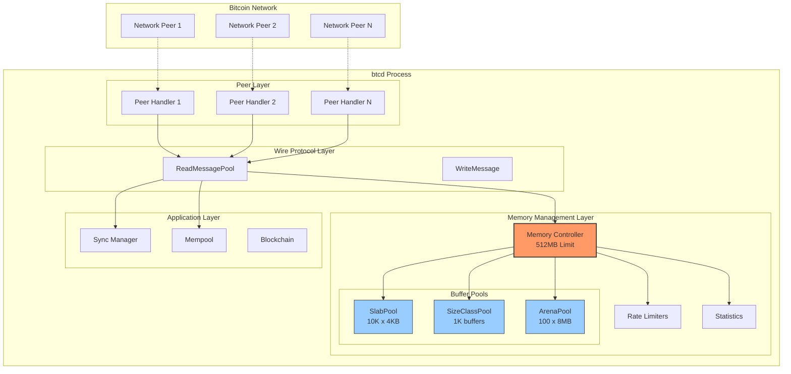

## Architecture Overview

The system uses a hierarchical design with three main layers:

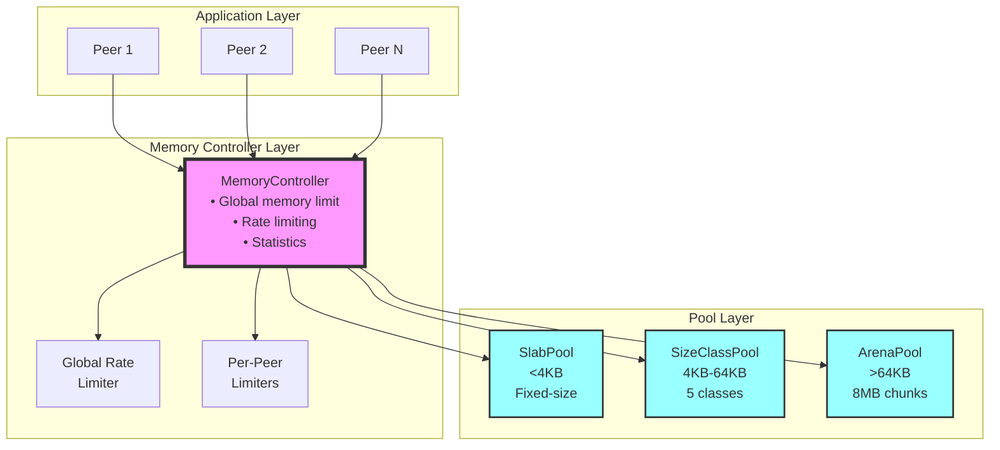

### Component Dependencies

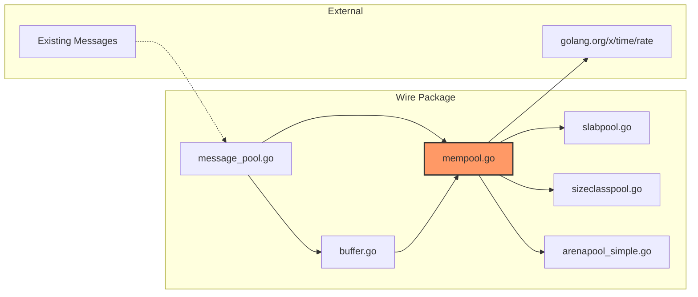

## Core Components

### MemoryController

The central coordinator that manages all memory allocations:

```go
type MemoryController struct {
    config        *MemoryConfig     // Configuration parameters
    currentUsage  atomic.Int64      // Current memory usage in bytes
    peakUsage     atomic.Int64      // Peak memory usage tracking
    
    // Rate limiters
    globalLimiter *rate.Limiter     // Global allocation rate limit
    peerLimiters  sync.Map          // Per-peer rate limiters
    
    // Buffer pools
    smallPool     Pool              // SlabPool for <4KB
    mediumPool    Pool              // SizeClassPool for 4-64KB
    largePool     Pool              // ArenaPool for >64KB
    
    // Statistics
    stats         MemoryStats       // Allocation statistics
}
```

**Key Responsibilities:**
- Enforces global memory limit
- Routes allocations to appropriate pool
- Tracks usage statistics
- Manages rate limiting
- Handles memory pressure

### Buffer

Reference-counted buffer wrapper providing safe lifecycle management:

```go
type Buffer struct {
    data       []byte          // Underlying byte slice
    pool       Pool            // Originating pool
    controller *MemoryController
    refCount   atomic.Int32    // Reference counter
    lastUsed   atomic.Int64    // Unix timestamp
    size       int             // Requested size
}
```

**Key Features:**
- Automatic return to pool when refCount reaches zero
- Thread-safe reference counting
- Tracks usage for eviction
- Prevents use-after-free

## Buffer Allocation Flow

### Allocation Process

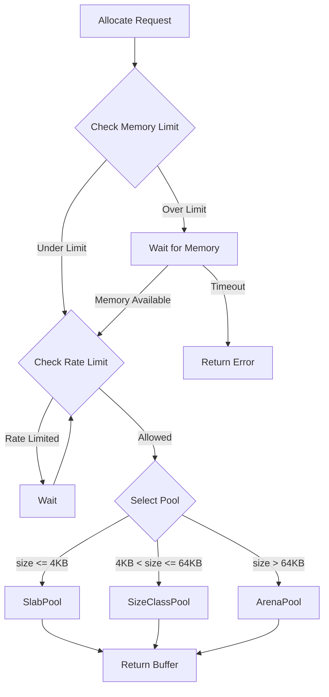

### Deallocation Process

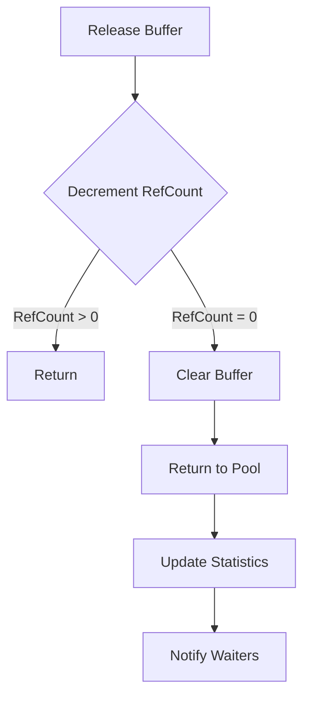

## Pool Implementations

### Pool Interface and Relationships

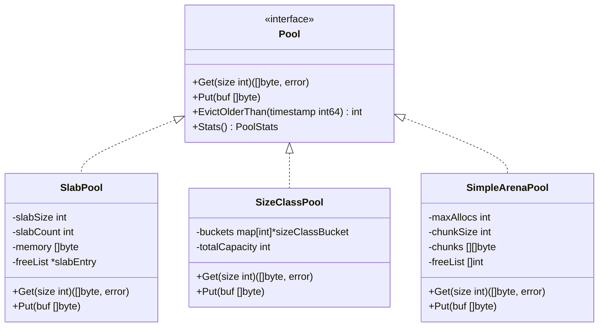

### SlabPool (Small Buffers)

Optimized for high-frequency small allocations:

```go
// Pre-allocated memory divided into fixed-size slabs
type SlabPool struct {
    slabSize   int              // Fixed size (4KB)
    slabCount  int              // Number of slabs
    memory     []byte           // Contiguous memory block
    freeList   *slabEntry       // Available slabs
    allEntries []*slabEntry     // All slabs for tracking
}
```

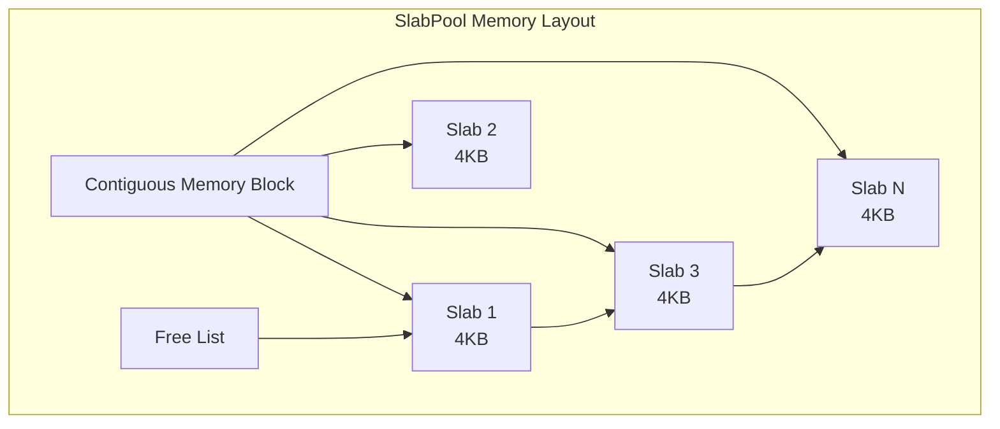

**Characteristics:**
- O(1) allocation and deallocation
- No fragmentation
- Minimal overhead
- Best for uniform small messages

### SizeClassPool (Medium Buffers)

Handles variable-sized medium allocations efficiently:

```go
// Multiple buckets for different size classes
type SizeClassPool struct {
    buckets map[int]*sizeClassBucket  // Size -> bucket mapping
    // Size classes: 4KB, 8KB, 16KB, 32KB, 64KB
}
```

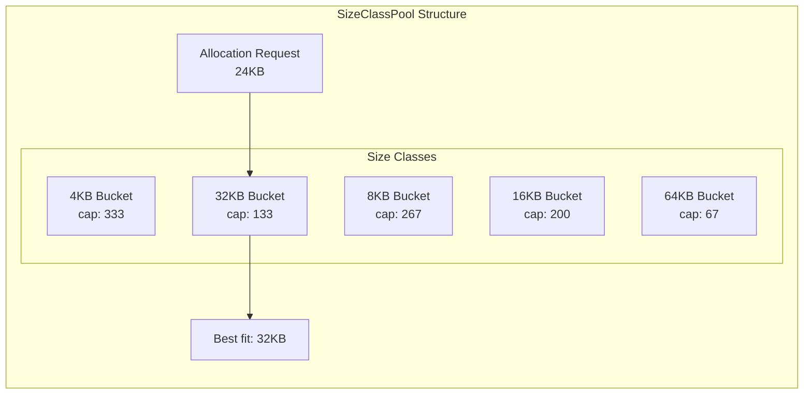

**Characteristics:**
- Reduces internal fragmentation
- Weighted distribution (smaller sizes get more slots)
- Best-fit allocation within class
- Suitable for transactions and headers

### SimpleArenaPool (Large Buffers)

Manages large allocations for blocks:

```go
// Fixed-size chunks for large messages
type SimpleArenaPool struct {
    maxAllocs  int              // Maximum concurrent allocations
    chunkSize  int              // 8MB per chunk
    chunks     [][]byte         // Pre-allocated chunks
    freeList   []int            // Available chunk indices
}
```

**Characteristics:**
- Simple and efficient
- No fragmentation concerns
- Ideal for block messages
- Predictable memory usage

## Rate Limiting

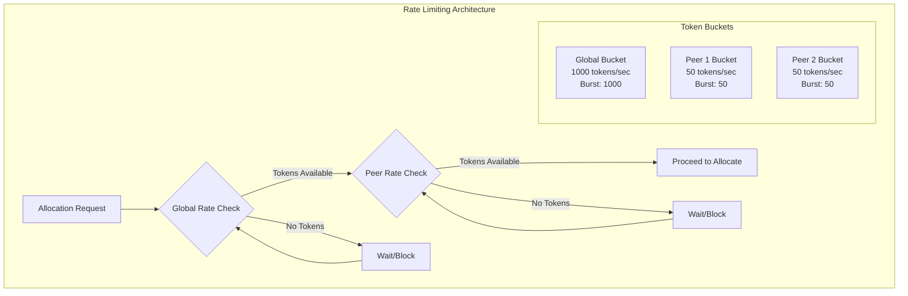

### Global Rate Limiting

Prevents system-wide allocation floods:

```go
// Default: 1000 allocations/second
globalLimiter := rate.NewLimiter(1000, 1000)
```

### Per-Peer Rate Limiting

Ensures fair resource allocation:

```go
// Default: 50 allocations/second per peer
peerLimiter := rate.NewLimiter(50, 50)
```

**Rate Limiting Strategy:**
- Token bucket algorithm
- Non-blocking checks for normal operations
- Blocking wait during high load
- Automatic cleanup on peer disconnect

## Memory Management

### Memory Pressure Handling

```mermaid
stateDiagram-v2
    [*] --> Normal: Under limit
    Normal --> Pressure: Near limit (90%)
    Pressure --> Blocking: At limit
    Blocking --> Normal: Memory freed
    Pressure --> Normal: Memory freed
    
    state Normal {
        Allocate --> Success
    }
    
    state Pressure {
        Allocate --> TriggerGC
        TriggerGC --> EvictBuffers
        EvictBuffers --> CheckLimit
        CheckLimit --> Success: Space available
        CheckLimit --> Wait: Still over
    }
    
    state Blocking {
        Allocate --> RegisterWaiter
        RegisterWaiter --> BlockWithTimeout
        BlockWithTimeout --> Success: Notified
        BlockWithTimeout --> Timeout: 30s elapsed
    }
```

When approaching memory limits:

1. **Blocking Allocation**: New allocations wait up to 30 seconds
2. **Memory Reclamation**: Trigger GC and buffer eviction
3. **Notification System**: Wake waiting allocations when memory available

```go
func (mc *MemoryController) waitForMemory(size int) error {
    waiter := make(chan struct{})
    mc.registerWaiter(waiter, size)
    
    select {
    case <-waiter:
        return nil  // Memory available
    case <-time.After(30 * time.Second):
        return ErrAllocationTimeout
    }
}
```

### Buffer Eviction

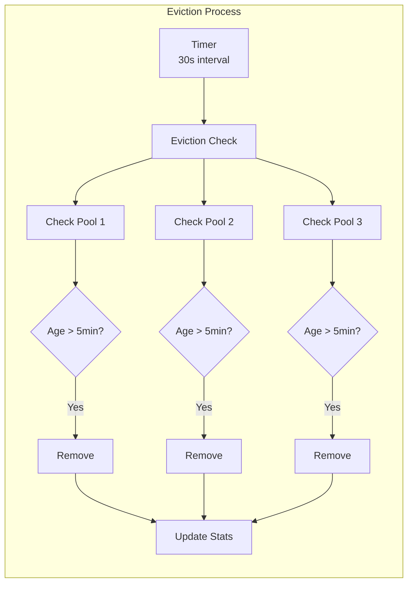

Periodic cleanup of old unused buffers:

```go
// Runs every 30 seconds
func (mc *MemoryController) evictionLoop() {
    for {
        mc.evictBuffersOlderThan(5 * time.Minute)
        time.Sleep(mc.config.EvictionInterval)
    }
}
```

## API Reference

### Basic Usage

```go
// Global initialization (once at startup)
config := wire.DefaultMemoryConfig()
mc, err := wire.NewMemoryController(config)
wire.SetGlobalMemoryController(mc)

// Allocate buffer
buf, err := mc.AllocateBuffer(size)
if err != nil {
    return err
}
defer buf.Release()

// Use buffer
data := buf.Bytes()
// ... process data ...
```

### Call Graph for Message Reading

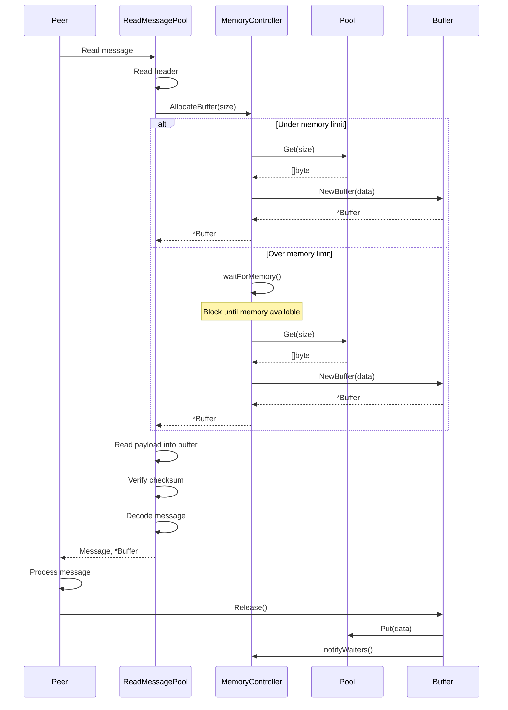

### Message Reading Integration

```go
// Read message with pooled buffer
msg, buf, err := wire.ReadMessagePool(reader, pver, btcnet)
if err != nil {
    return err
}
defer buf.Release()

// Transfer ownership to message (if supported)
if holder, ok := msg.(wire.BufferHolder); ok {
    holder.SetBuffer(buf)
    // No need to defer Release() - message owns it now
}
```

### Per-Peer Rate Limiting

```go
// Read with peer-specific rate limiting
msg, buf, err := wire.ReadMessagePoolForPeer(
    reader, pver, btcnet, peerID,
)
if err != nil {
    return err
}
defer buf.Release()
```

## Configuration

### MemoryConfig Structure

```go
type MemoryConfig struct {
    // Memory limits
    MaxMemory        int64  // Total memory limit (bytes)
    
    // Pool sizes
    SmallPoolSize    int    // Number of small buffers
    MediumPoolSize   int    // Number of medium buffers
    LargePoolSize    int    // Number of large buffers
    
    // Rate limiting
    GlobalAllocRate  int    // Global allocations/second
    PerPeerAllocRate int    // Per-peer allocations/second
    
    // Maintenance
    EvictionInterval time.Duration // How often to check for eviction
    BufferMaxAge     time.Duration // Maximum buffer age before eviction
}
```

### Default Configuration

```go
func DefaultMemoryConfig() *MemoryConfig {
    return &MemoryConfig{
        MaxMemory:        512 * 1024 * 1024,  // 512MB
        SmallPoolSize:    10000,              // 40MB total
        MediumPoolSize:   1000,               // ~64MB total
        LargePoolSize:    100,                // ~800MB total
        GlobalAllocRate:  1000,               // 1000/sec
        PerPeerAllocRate: 50,                 // 50/sec/peer
        EvictionInterval: 30 * time.Second,
        BufferMaxAge:     5 * time.Minute,
    }
}
```

### Tuning Guidelines

**For High-Traffic Nodes:**
```go
config := &MemoryConfig{
    MaxMemory:        1024 * 1024 * 1024, // 1GB
    SmallPoolSize:    20000,
    MediumPoolSize:   2000,
    LargePoolSize:    200,
    GlobalAllocRate:  5000,
    PerPeerAllocRate: 100,
}
```

**For Memory-Constrained Systems:**
```go
config := &MemoryConfig{
    MaxMemory:        256 * 1024 * 1024,  // 256MB
    SmallPoolSize:    5000,
    MediumPoolSize:   500,
    LargePoolSize:    50,
    GlobalAllocRate:  500,
    PerPeerAllocRate: 25,
}
```

## Best Practices

### 1. Always Release Buffers

```go
// Good: Always release
buf, err := mc.AllocateBuffer(size)
if err != nil {
    return err
}
defer buf.Release()

// Bad: Leaks memory
buf, err := mc.AllocateBuffer(size)
// Missing release!
```

### 2. Transfer Ownership Appropriately

```go
// When passing buffer to long-lived objects
block := &BlockWithBuffer{MsgBlock: msgBlock}
block.SetBuffer(buf)  // Transfers ownership
// Don't release here - block owns it
```

### 3. Handle Allocation Failures

```go
buf, err := mc.AllocateBuffer(size)
if err != nil {
    if errors.Is(err, wire.ErrMemoryLimitExceeded) {
        // Handle memory pressure
        return nil  // Drop message
    }
    return err
}
```

### 4. Monitor Statistics

```go
stats := mc.Stats()
log.Printf("Memory: current=%dMB peak=%dMB efficiency=%.1f%%",
    stats.CurrentUsage/(1024*1024),
    stats.PeakUsage/(1024*1024),
    float64(stats.BuffersRecycled)/float64(stats.TotalAllocations)*100,
)
```

### 5. Clean Shutdown

```go
// Graceful shutdown
mc.Shutdown()
// This stops background workers and allows final cleanup
```

## Performance Considerations

### Allocation Patterns

- **Small messages** (<4KB): Near-zero overhead from SlabPool
- **Medium messages** (4-64KB): ~100ns allocation from SizeClassPool  
- **Large messages** (>64KB): ~200ns allocation from ArenaPool

### Memory Overhead

- **SlabPool**: <1% overhead (metadata only)
- **SizeClassPool**: 5-20% (depends on size distribution)
- **ArenaPool**: <5% (8MB chunks for 4MB average)

### Concurrency

- Lock-free statistics updates
- Per-pool locking minimizes contention
- Rate limiters use atomic operations
- Scales to hundreds of concurrent peers

## Troubleshooting

### Common Issues

**1. Allocation Timeouts**
```
Error: allocation timeout after 30s
```
- Increase `MaxMemory` limit
- Check for buffer leaks
- Review allocation patterns

**2. High Fragmentation**
```
Stats showing high miss rate in SizeClassPool
```
- Adjust size class distribution
- Consider increasing pool sizes
- Monitor allocation patterns

**3. Rate Limit Blocks**
```
Peer consistently hitting rate limits
```
- Check for misbehaving peers
- Adjust `PerPeerAllocRate`
- Implement peer scoring

### Debug Helpers

```go
// Detailed pool statistics
if pool, ok := mc.mediumPool.(*SizeClassPool); ok {
    detailed := pool.DetailedStats()
    for size, stats := range detailed {
        log.Printf("Size %d: cap=%d used=%d hits=%d",
            size, stats.Capacity, 
            stats.Capacity-stats.Size, stats.Hits)
    }
}

// Memory pressure detection
stats := mc.Stats()
usage := float64(stats.CurrentUsage) / float64(config.MaxMemory)
if usage > 0.9 {
    log.Warn("Memory pressure: %.1f%% used", usage*100)
}
```

## Future Enhancements

### Planned Improvements

1. **Dynamic Pool Sizing**: Adjust pool sizes based on usage patterns
2. **NUMA Awareness**: Allocate memory local to CPU for better performance
3. **Compression Support**: Optional compression for large messages
4. **Metrics Export**: Prometheus/OpenTelemetry integration
5. **Smart Eviction**: ML-based prediction of buffer reuse

### Extension Points

The architecture supports easy extension:

```go
// Custom pool implementation
type CustomPool struct {
    // Your implementation
}

func (p *CustomPool) Get(size int) ([]byte, error) { ... }
func (p *CustomPool) Put(buf []byte) { ... }
func (p *CustomPool) Stats() PoolStats { ... }

// Register with controller
mc.RegisterPool(sizeRange, customPool)
```

## Conclusion

The wire protocol memory pool system provides a robust, efficient solution for managing memory in btcd. By combining intelligent pooling strategies with strict limits and comprehensive monitoring, it prevents OOM conditions while maintaining excellent performance. The modular design allows for easy tuning and extension as requirements evolve.